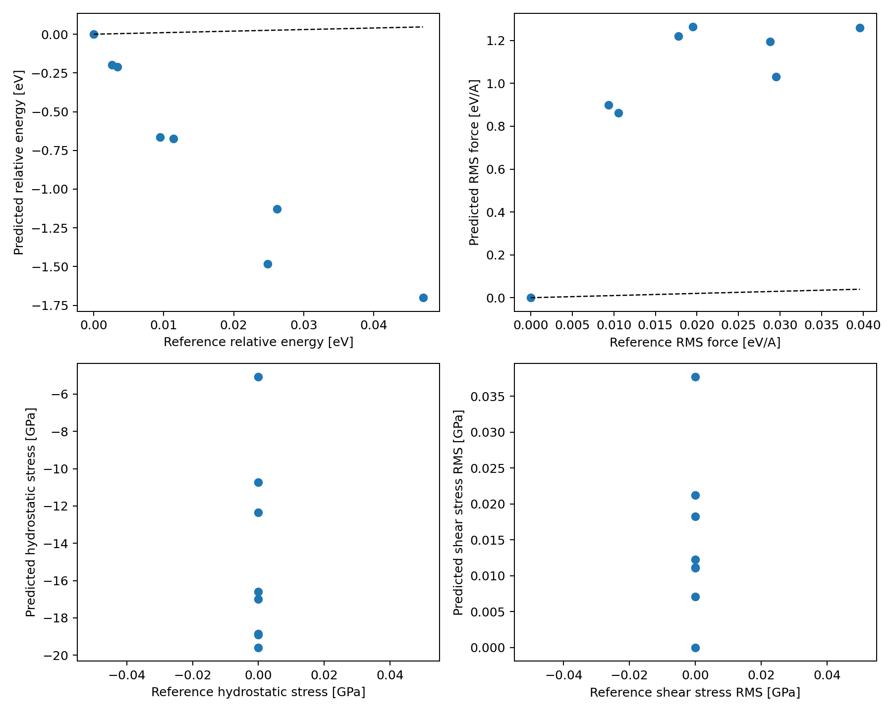
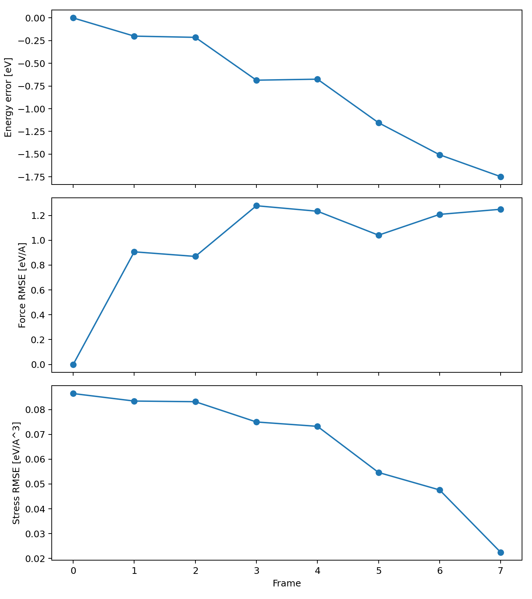

# BaTiO3 Pure-Python 20-Term Fit Validation Report

## Summary

A 20-term pure-Python fit was regenerated with an expanded third/fourth-order candidate basis. The basis includes displacement-only cubic/quartic terms and linear displacement-strain coupling terms (`eta*u^2` and `eta*u^3`). The validation remains in-sample and uses relative-energy comparison to frame 0.

## Inputs

- DDB: `examples/BaTiO3_example/BaTiO3_DDB`
- HIST: `examples/BaTiO3_training/real_training_run/BaTiO3_multibinit_HIST.nc`
- Candidate basis XML: `examples/BaTiO3_training/real_training_run/python_fit_ncoeff20_validation/BaTiO3_generated_basis_candidates.xml`
- Candidate basis count: 3292
- Linear strain-coupling candidate count: 1602
- Fitted XML: `examples/BaTiO3_training/real_training_run/python_fit_ncoeff20_validation/BaTiO3_fit_python_ncoeff20.xml`
- Supercell: `(2, 2, 2)` with 40 atoms
- Frames: 8

## Fit Diagnostics

- Selected terms: 20 / 20 requested
- Selected 1-based coefficient indices: `[12, 213, 234, 326, 455, 567, 1011, 1124, 1287, 1470, 1479, 1494, 1666, 1682, 1692, 1770, 1800, 1829, 1873, 2491]`
- Solver info: 0
- Matrix rank: 20
- Condition number: 7788.56
- Residual norm: 0.0515419
- Goal force: 0.0004177
- Goal stress: 0.00215716
- Goal energy: 8.17083e-05

## Atomchain-Style Error Metrics

| Quantity | Count | MAE | RMSE | Max Abs |
|---|---:|---:|---:|---:|
| Relative energy [eV] | 8 | 0.772994 | 0.979151 | 1.74796 |
| Forces [eV/A] | 960 | 0.717099 | 1.05095 | 4.22739 |
| Stress [eV/A^3] | 48 | 0.0464876 | 0.0690114 | 0.122272 |

## Comparison Metrics

| Quantity | R2 | RMSE | MAE |
|---|---:|---:|---:|
| Relative energy [eV] | -4249.54 | 0.979151 | 0.772994 |
| RMS forces [eV/A] | -7225.13 | 1.02234 | 0.946927 |
| Hydrostatic stress [GPa] | 0 | 15.6267 | 14.8838 |
| Shear stress [GPa] | 0 | 0.0182275 | 0.0148615 |

## Figures

## Notes

- This basis includes cubic and quartic displacement terms plus linear displacement-strain coupling terms.
- The validation set is still in-sample: the same 8 HIST frames are used for fitting and validation.
