# BaTiO3 Training And Validation Report

## Scope

This report summarizes the BaTiO3 in-sample validation results for the trained models produced during the Python/Fortran parity investigation.

All metrics use the same 8-frame BaTiO3 HIST training set and the same DDB-backed fixed model settings:

- DDB: `/home/hexu/projects/atomchain_dev/atomchain/.tmp/batio3_ddb_example/BaTiO3_stress.ddb`
- HIST: `../BaTiO3_multibinit_HIST.nc`
- Supercell: `2 2 2`
- Fitting/evaluation fixed model: `dipdip=False`, matching MULTIBINIT input `dipdip 0`
- Validation split: in-sample, all 8 training frames
- Energy metric: relative energy to frame 0, in eV
- Force metric: all Cartesian force components, in eV/Ang
- Stress metric: Voigt stress components, in eV/Ang^3

Full machine-readable results are in `trained_model_validation_metrics.json`.

## Trained Models

| Model | Source | Terms Used | Basis | Status |
|---|---|---:|---|---|
| Fortran ncoeff=3 | MULTIBINIT | 3 | Fortran-generated cubic XML | Complete |
| Python same-basis ncoeff=3 | `fit_multibinit_model_python()` | 3 | Same Fortran 3-term XML | Complete |
| Python ncoeff=20 power 3-4 | `fit_multibinit_model_python()` greedy selection | 20 nonzero from 3292 candidates | Python-generated cubic/quartic displacement and linear strain-coupling basis | Complete |
| Fortran ncoeff=20 power 3-4 | MULTIBINIT | 20 requested | Fortran-generated | Blocked, see below |

## Training Workflow

### Fortran 3-Term Reference

The successful Fortran reference uses `fit_iatom=0`, which loops over irreducible atom groups. This was the reliable Fortran path for BaTiO3.

Input file:

`../fortran_parity_ncoeff3/BaTiO3_fit_ncoeff3.abi`

Important settings:

```text
latt_harm_pot_fname "/home/hexu/projects/atomchain_dev/atomchain/.tmp/batio3_ddb_example/BaTiO3_stress.ddb"
latt_training_set_fname "../BaTiO3_multibinit_HIST.nc"
dipdip 0
asr 0
ncell 2 2 2
fit_coeff 1
fit_EFS 1 1 1
fit_iatom 0
fit_ncoeff 3
fit_generateCoeff 1
fit_rangePower 3 3
fit_dispterms 1
fit_anhaStrain 0
fit_SPCoupling 0
fit_cutoff 8.0
```

Run command:

```bash
"/home/hexu/projects/abibuildbot_dev/abibuildbot/docker-worker-ubuntu22-gcc-openmpi-openblas/state/docker_ubuntu22.04_gnu_openmpi_openblas/abinit_master/src/98_main/multibinit" \
  "BaTiO3_fit_ncoeff3.abi" \
  > "multibinit_iatom0.stdout.log" \
  2> "multibinit_iatom0.stderr.log"
```

Output XML:

`../fortran_parity_ncoeff3/BaTiO3_fit_ncoeff3_coeffs.xml`

### Python Refit On Same 3-Term Basis

The Python same-basis model refits only the three coefficients from the successful Fortran XML. It uses the same fixed model semantics as the Fortran input, including `dipdip=False`.

Conceptual workflow:

```python
unitcell = read_ddb(BaTiO3_stress_ddb)
fixed_model = EffectivePotential(build_supercell(unitcell, (2, 2, 2), dipdip=False))

result = fit_multibinit_model_python(
    ddb=BaTiO3_stress_ddb,
    hist=BaTiO3_multibinit_HIST,
    basis_xml=BaTiO3_fit_ncoeff3_coeffs_xml,
    config=PythonFitConfig(ncell=(2, 2, 2), fit_on=(True, True, True), selection="all"),
    fixed_model=fixed_model,
)
```

### Python 20-Term Power 3-4 Model

The Python 20-term model uses the generated 3292-candidate XML basis from the power 3-4 workflow and greedy coefficient selection. The fitted XML writes all candidates, but only 20 coefficients are nonzero.

Basis XML:

`../python_fit_ncoeff20_validation/BaTiO3_generated_basis_candidates.xml`

Output XML:

`../fortran_parity_ncoeff20_power34/BaTiO3_fit_python_ncoeff20_power34_dipdip0.xml`

Workflow:

```python
unitcell = read_ddb(BaTiO3_stress_ddb)
fixed_model = EffectivePotential(build_supercell(unitcell, (2, 2, 2), dipdip=False))

result = fit_multibinit_model_python(
    ddb=BaTiO3_stress_ddb,
    hist=BaTiO3_multibinit_HIST,
    basis_xml=BaTiO3_generated_basis_candidates_xml,
    output_xml=BaTiO3_fit_python_ncoeff20_power34_dipdip0_xml,
    config=PythonFitConfig(
        ncell=(2, 2, 2),
        fit_on=(True, True, True),
        selection="greedy",
        ncoeff=20,
        regularization=1e-8,
    ),
    fixed_model=fixed_model,
)
```

### Fortran 20-Term Power 3-4 Status

An exact Fortran `fit_ncoeff=20`, `fit_rangePower=3 4` comparison could not be completed with the available generator paths.

| Attempt | Result |
|---|---|
| `fit_iatom=-1`, `fit_ncoeff=20`, `fit_rangePower=3 4` | Fails with known `m_polynomial_coeff.F90:2383` BUG |
| `fit_iatom=0`, `fit_ncoeff=20`, `fit_rangePower=3 4` | Rejected because 20 is not divisible by the 3 irreducible atom loops |
| `fit_iatom=-2`, `fit_ncoeff=20`, `fit_rangePower=3 4` | Timed out after 180 s during coefficient generation; no XML |
| nearest valid `fit_iatom=0`, `fit_ncoeff=21`, `fit_rangePower=3 4` | Timed out after 300 s during coefficient generation; no XML |

Because no Fortran 20-term XML was produced, the 20-term comparison below includes Python 20-term results but not an exact Fortran 20-term row.

## Validation Method

Each model was evaluated with the pure-Python `EffectivePotential` path using `build_supercell(..., dipdip=False)` to match the MULTIBINIT input.

For each HIST frame:

1. Align the HIST frame atom order to the DDB supercell reference order.
2. Evaluate total model energy, forces, and stress.
3. Compare relative energy to frame 0.
4. Compare all force components to HIST forces.
5. Compare all six Voigt stress components to HIST stress.

The validation is in-sample. It measures how well each fitted model reproduces the training frames, not generalization to held-out configurations.

## Summary Metrics

| Model | Rel. Energy RMSE (eV) | Force RMSE (eV/Ang) | Stress RMSE (eV/Ang^3) | Rel. Energy Max Abs (eV) | Force Max Abs (eV/Ang) |
|---|---:|---:|---:|---:|---:|
| Fortran ncoeff=3 | 0.014204 | 0.017540 | 8.9808e-06 | 0.028713 | 0.086372 |
| Python same-basis ncoeff=3 | 0.014552 | 0.017492 | 8.4151e-06 | 0.029754 | 0.087037 |
| Python ncoeff=20 power 3-4 | 0.011005 | 0.012150 | 1.6608e-05 | 0.022603 | 0.074025 |

The Python 20-term model improves relative-energy and force RMSE over the 3-term models. Its stress RMSE is still very small in absolute units, but worse than the 3-term models because the greedy objective trades a little stress accuracy for energy/force improvement.

## Coefficients

Fortran 3-term XML coefficients:

| Coeff | Value |
|---:|---:|
| 1 | 0.01247262632 |
| 2 | 0.01485736148 |
| 3 | -0.02633987127 |

Python same-basis 3-term coefficients:

| Coeff | Value |
|---:|---:|
| 1 | 0.01204185827 |
| 2 | 0.01171809925 |
| 3 | -0.02403043066 |

The 3-term Python coefficients are close to the Fortran coefficients after matching the XML displacement convention and `dipdip 0` fixed-model setting.

## Figures

### RMSE Comparison

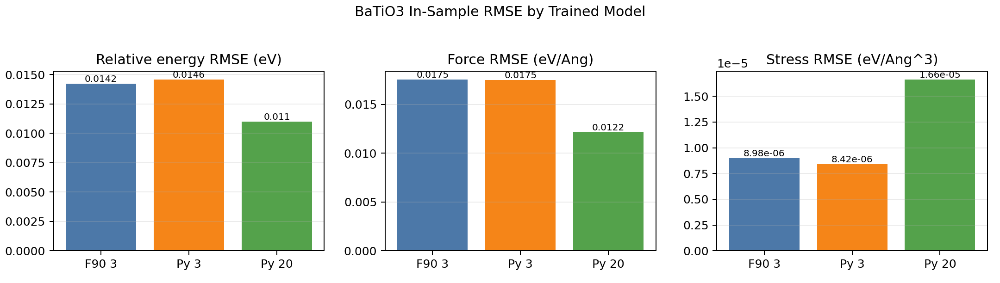

### Energy And Force Parity

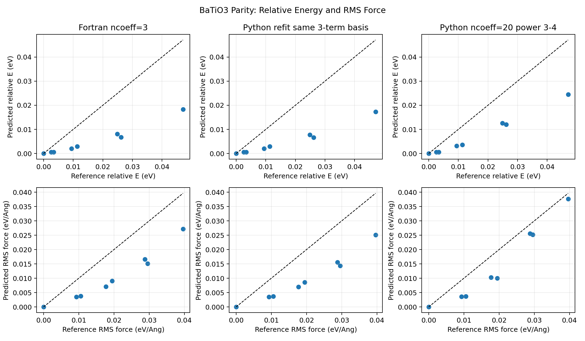

### Frame-Resolved Errors

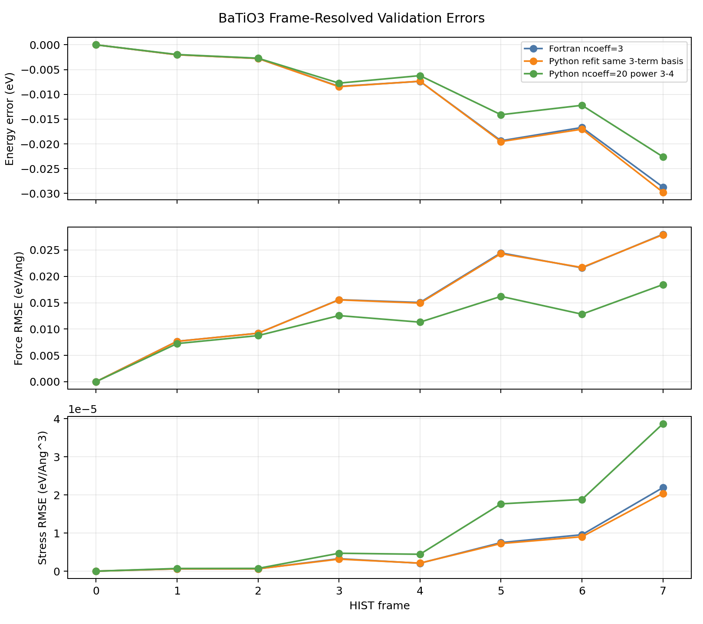

### Stress Parity

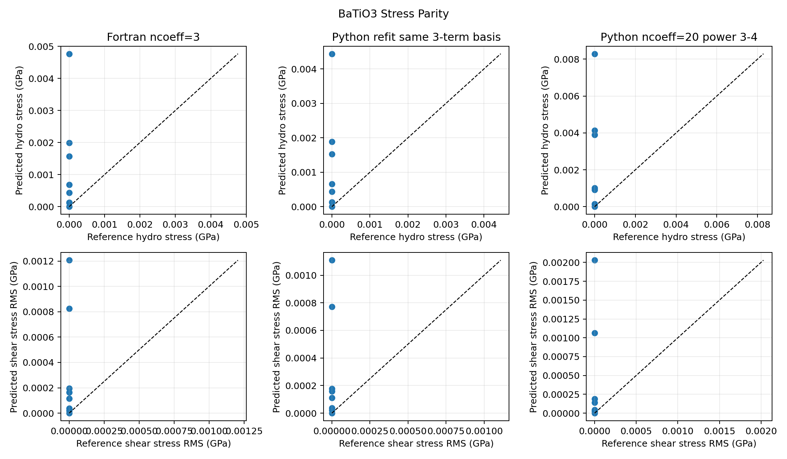

### Phonon Band From Trained Model

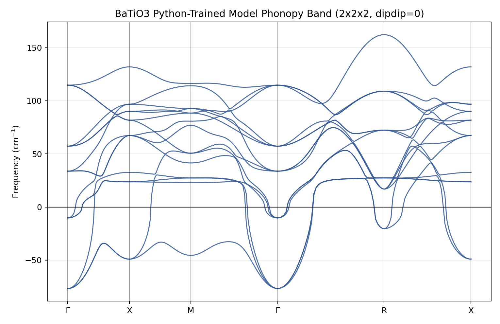

This band was generated with atomchain's Python environment and `phonopy` by wrapping the trained pure-Python `pymultibinit` model as an ASE calculator. The calculation used the Python 20-term power 3-4 XML, `dipdip=False`, a `2x2x2` phonopy supercell, and finite displacements of `0.01 Angstrom`. Phonopy generated 3 symmetry-inequivalent displacements. The frequency range on the plotted path is `-76.73` to `162.24 cm^-1`.

Files:

- Figure: `trained_model_phonopy_frozen_phonon_bands.png`
- Band data: `trained_model_phonopy_frozen_phonon_bands_cm1.dat`
- Summary JSON: `trained_model_phonopy_frozen_phonon_bands_summary.json`

Additional no-symmetry phonopy check:

- Figure: `trained_model_phonopy_nosym_bands.png`
- Band data: `trained_model_phonopy_nosym_bands_cm1.dat`
- Summary JSON: `trained_model_phonopy_nosym_bands_summary.json`
- This used 30 finite-displacement force calculations and gave a frequency range of `-90.47` to `163.45 cm^-1`.

### Direct DDB Band Comparison

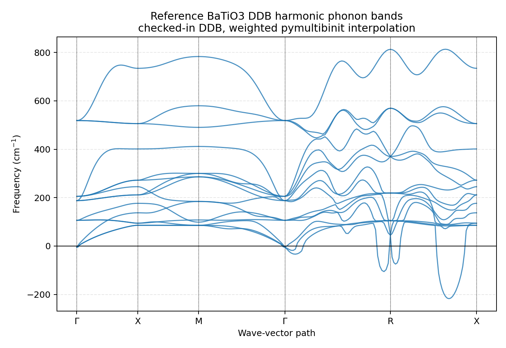

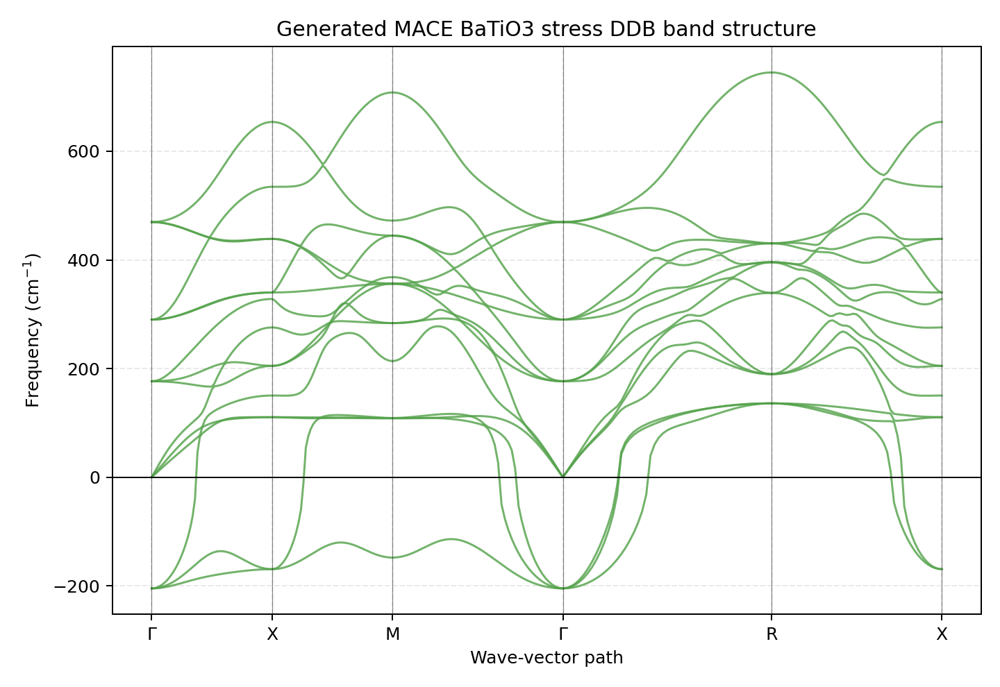

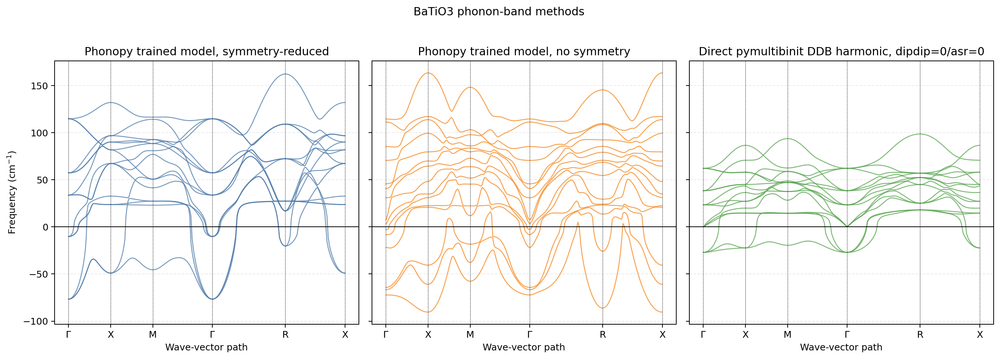

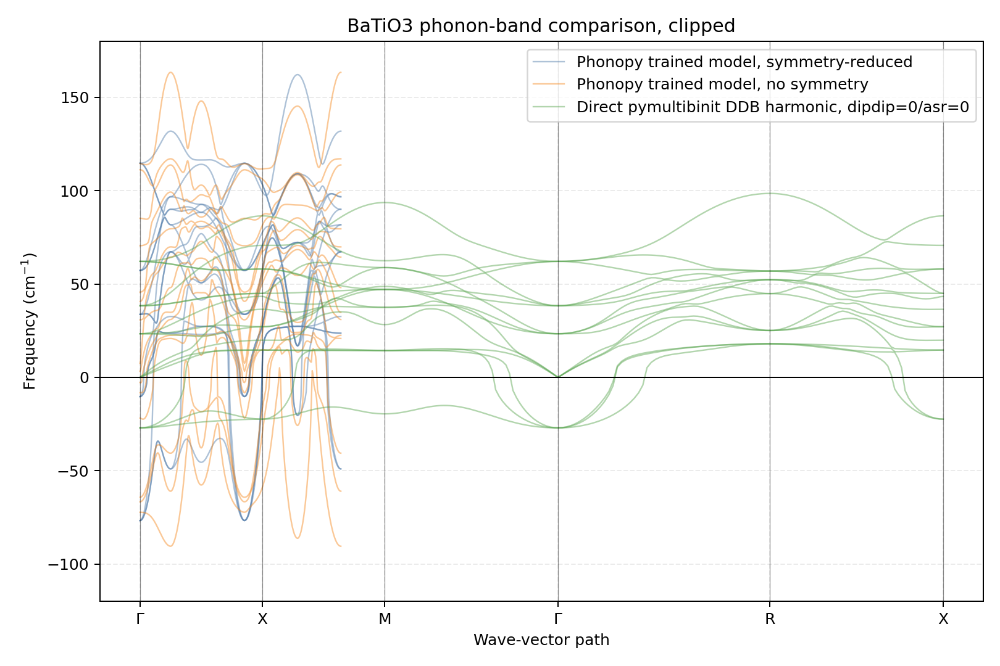

### All Current Phonon Band Methods

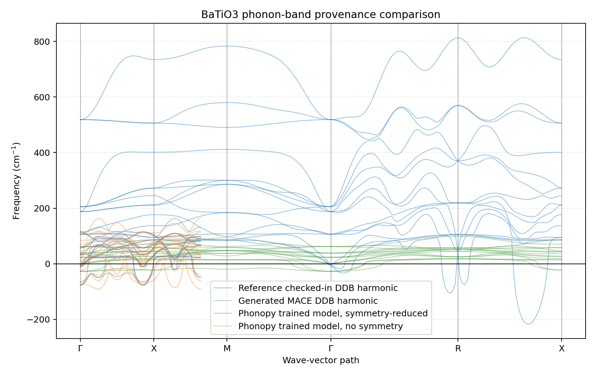


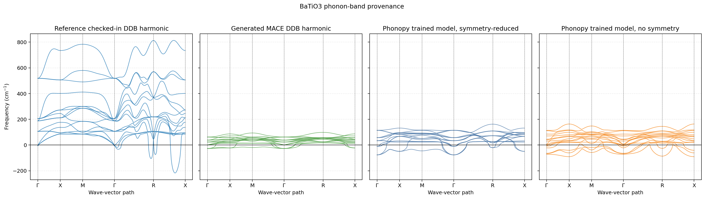

Summary JSON: `phonon_band_all_methods_summary.json`

The direct DDB harmonic interpolation path now uses Wigner-Seitz IFC weights. The checked-in reference DDB, `examples/BaTiO3_example/BaTiO3_DDB`, gives the expected BaTiO3 scale: `-217.43` to `813.36 cm^-1`. The atomchain-generated MACE DDB used by the fitting sandbox is internally consistent but much softer: `-27.07` to `98.57 cm^-1`, with Gamma frequencies matching its raw parsed DDB/MULTIBINIT output. The trained-model phonopy finite-displacement bands are also tied to that softer generated-DDB training baseline, with ranges near `-90` to `163 cm^-1`. Direct finite differences of `EffectivePotential.evaluate()` energy agree with analytical forces to `~1e-12 Ha/Bohr`, and manual central-difference force constants agree with the internal pyeffpot Hessian to `~2e-12` relative error.

Force-check files:

- `force_finite_difference_check.json`
- `force_constant_manual_fd_vs_internal_check.json`
- `force_constant_phonopy_vs_internal_nosym_check.json`

## Interpretation

The corrected Python workflow is now comparable to the successful Fortran 3-term reference. The earlier large errors were caused mainly by two confirmed parity issues:

- XML displacement factors must be evaluated as `u_atom_a - u_atom_b`, matching MULTIBINIT.
- The DDB fixed model must respect the MULTIBINIT input `dipdip` and `asr` settings. For these runs, `dipdip 0` and `asr 0` mean Python parity checks should use `build_supercell(..., dipdip=False, asr=False)` when preserving the raw DDB harmonic model.

With those corrections, the 3-term Python and Fortran models have nearly identical in-sample force and stress RMSE, with slightly different energy RMSE. The Python 20-term power 3-4 model further improves relative-energy and force RMSE, but an exact Fortran 20-term comparison remains blocked by MULTIBINIT generator behavior.

## Artifacts

- Metrics JSON: `trained_model_validation_metrics.json`
- Fortran 3-term XML: `../fortran_parity_ncoeff3/BaTiO3_fit_ncoeff3_coeffs.xml`
- Python 20-term XML: `../fortran_parity_ncoeff20_power34/BaTiO3_fit_python_ncoeff20_power34_dipdip0.xml`
- Python 20-term metrics JSON: `../fortran_parity_ncoeff20_power34/BaTiO3_fit_python_ncoeff20_power34_dipdip0_metrics.json`
- Figures: `rmse_comparison.png`, `energy_force_parity.png`, `frame_error_trends.png`, `stress_parity.png`
- Phonopy band figure: `trained_model_phonopy_frozen_phonon_bands.png`
- Direct DDB band figure: `ddb_direct_pymultibinit_phonon_bands.png`
- Band method comparison figures: `phonon_band_method_comparison.png`, `phonon_band_method_overlay_clipped.png`
